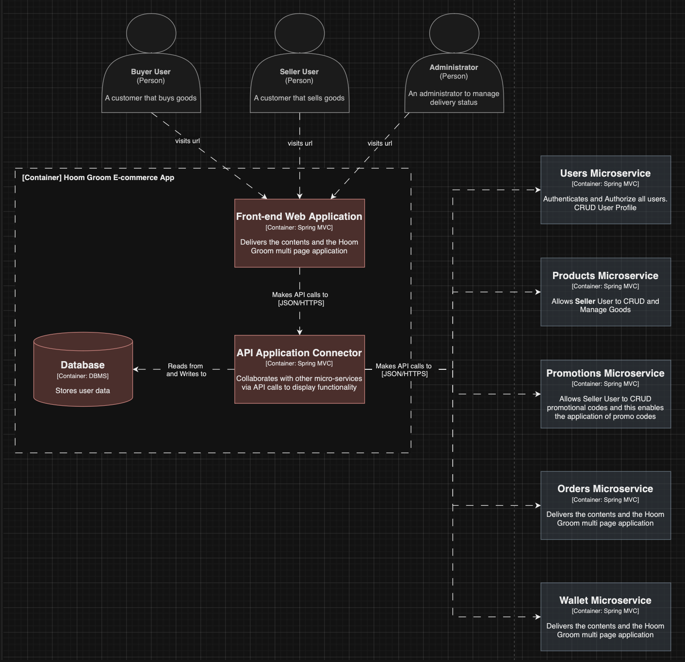
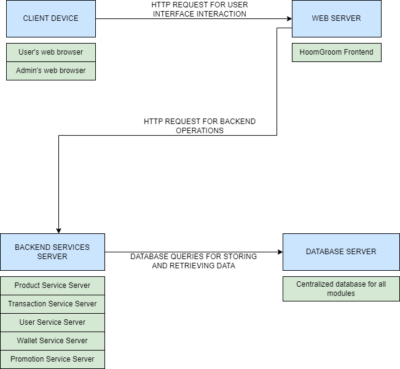

## 1. The current architecture of group C6-HoomGroom, the context, container and deployment diagram.

- The Context Diagram
  
- The Container Diagram
  
- The Deployment Diagram
  

## 3. Explanation of risk storming of group C6-HoomGroom.
#### Risk Storming
- Availability:
The use of a central database was identified as high risk due to high impact (product, transaction, user, wallet, and promotion service).
Other parts of the system were not deemed as risk for availability due to multiple instances for each service and clustering of the API gateway.
- Security:
Likelihood of a risk occurring was not rated high because the security checks for each API call and all calls go through different gateways.
Due to the centralised database, there was a medium risk between wallet service and transaction service because when a user buys an item, their balance is supposed to change.
- Scalability:
There was concern for the discount seasons, when anticipated load on the system would significantly increase.